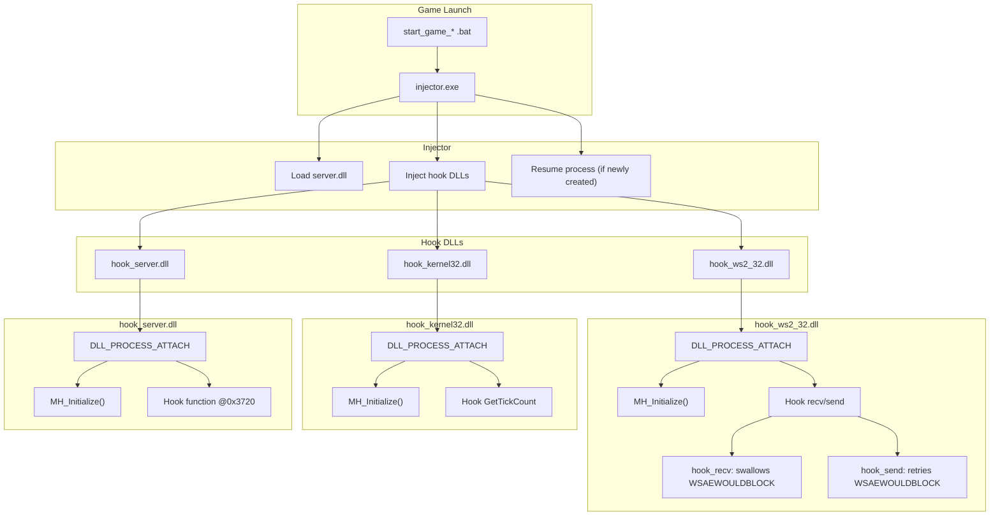

# Hooking Overview

This document provides a quick reference for developers on how the injector loads the patched server module and the hook DLLs. The diagram summarizes the process and the main functions each hook intercepts.

The injector first loads `server.dll`, then injects each hook DLL. During `DLL_PROCESS_ATTACH`, every hook uses MinHook to intercept the respective functions. See the source files in `src/` for the implementation details.
